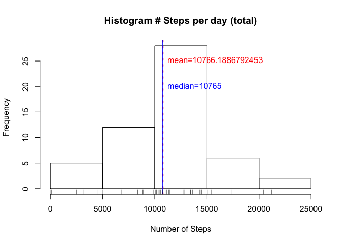

# Reproducible Research: Peer Assessment 1 - Student HStarling


## Loading and preprocessing the data
## Load dependencies
First we need to load any libraries that will be used in the data processing. These
are dplyr (for data manipulation) and ggplot2 (for plotting).

```r
library(dplyr)
```

```
## 
## Attaching package: 'dplyr'
## 
## The following objects are masked from 'package:stats':
## 
##     filter, lag
## 
## The following objects are masked from 'package:base':
## 
##     intersect, setdiff, setequal, union
```

```r
library(ggplot2)
```

## Pull data from online location
Now we pull down the data and load it up. Data is initially loaded into a data frame named **allData**.

```r
fileUrl <- "https://d396qusza40orc.cloudfront.net/repdata%2Fdata%2Factivity.zip"
fileNm <- "activity.csv"
temp <- tempfile()
download.file(fileUrl,temp)
allData <- tbl_df(read.table(unz(temp, fileNm), sep=",", header=TRUE, 
                             stringsAsFactors = FALSE, na.strings = c("?","","NA")))
unlink(temp)
```

We also need to update the date column to be in true date format.

```r
allData$date <- as.Date(allData$date, format = "%Y-%m-%d")
head(allData)
```

```
## Source: local data frame [6 x 3]
## 
##   steps       date interval
##   (int)     (date)    (int)
## 1    NA 2012-10-01        0
## 2    NA 2012-10-01        5
## 3    NA 2012-10-01       10
## 4    NA 2012-10-01       15
## 5    NA 2012-10-01       20
## 6    NA 2012-10-01       25
```

```r
tail(allData)
```

```
## Source: local data frame [6 x 3]
## 
##   steps       date interval
##   (int)     (date)    (int)
## 1    NA 2012-11-30     2330
## 2    NA 2012-11-30     2335
## 3    NA 2012-11-30     2340
## 4    NA 2012-11-30     2345
## 5    NA 2012-11-30     2350
## 6    NA 2012-11-30     2355
```

## What is mean total number of steps taken per day?
We need to calculate the total number of steps per day and then take the mean of
these values. In order to do this, we first need to group the data by days. We do this using group_by and creating a new data set called **days**.

```r
days <- group_by(allData, date)
```

Then we create a summarized data set called **summaryDays** using the days data set. **This data set has the total number of steps by day**.

```r
summaryDays <- summarize(days, totalSteps=sum(steps))
head(summaryDays)
```

```
## Source: local data frame [6 x 2]
## 
##         date totalSteps
##       (date)      (int)
## 1 2012-10-01         NA
## 2 2012-10-02        126
## 3 2012-10-03      11352
## 4 2012-10-04      12116
## 5 2012-10-05      13294
## 6 2012-10-06      15420
```

```r
tail(summaryDays)
```

```
## Source: local data frame [6 x 2]
## 
##         date totalSteps
##       (date)      (int)
## 1 2012-11-25      11834
## 2 2012-11-26      11162
## 3 2012-11-27      13646
## 4 2012-11-28      10183
## 5 2012-11-29       7047
## 6 2012-11-30         NA
```

Now we calculate the mean and median using this set (leaving out NAs).

```r
meanSteps <- mean(summaryDays$totalSteps, na.rm=T)
meanSteps
```

```
## [1] 10766.19
```

```r
medSteps <- median(summaryDays$totalSteps, na.rm=T)
medSteps
```

```
## [1] 10765
```

We can get a better look at this data by plotting a histogram of the total number of steps taken each day.  Oddly enough, it resembles a normal distribution.  Note we have also indicated the calculated mean and median values on this plot.

```r
hist(summaryDays$totalSteps, xlab="Number of Steps", main="Histogram # Steps per day (total)")
abline(v=meanSteps, col="red", lwd=3, lty=3)
abline(v=medSteps, col="blue")
rug(summaryDays$totalSteps)
text(x=meanSteps, y=25, pos=4, labels=paste("mean",meanSteps,sep="="), col="red")
text(x=medSteps, y=20, pos=4, labels=paste("median",medSteps,sep="="), col="blue")
```

 

## What is the average daily activity pattern?
Using our original data set (allData) we now create a data set to understand the average daily activity pattern. First we group the data by day...

```r
patterns <- group_by(allData, interval)
```
Then we create a summary data set named **summaryPatterns** that represents the average steps per interval across the entire set (leaving out NAs).

```r
summaryPatterns <- summarize(patterns, avgSteps=mean(steps, na.rm=T))
head(summaryPatterns)
```

```
## Source: local data frame [6 x 2]
## 
##   interval  avgSteps
##      (int)     (dbl)
## 1        0 1.7169811
## 2        5 0.3396226
## 3       10 0.1320755
## 4       15 0.1509434
## 5       20 0.0754717
## 6       25 2.0943396
```

```r
tail(summaryPatterns)
```

```
## Source: local data frame [6 x 2]
## 
##   interval  avgSteps
##      (int)     (dbl)
## 1     2330 2.6037736
## 2     2335 4.6981132
## 3     2340 3.3018868
## 4     2345 0.6415094
## 5     2350 0.2264151
## 6     2355 1.0754717
```

We can determine the 5 minute interval that contains the maximum number of steps.
First we determine the row in the data set that has the maximum value.

```r
intMaxRow <- which.max(summaryPatterns$avgSteps)
intMaxRow
```

```
## [1] 104
```
Then we find the value for that row.

```r
xValue <- summaryPatterns$interval[intMaxRow]
xValue
```

```
## [1] 835
```

Now we can plot the information to visualize the daily pattern. This uses the ggplot2 library.

```r
g <- ggplot(summaryPatterns, aes(interval, avgSteps))
g <- g + labs(title="Avg Daily Activity Pattern") + labs(x="5 Minute Interval") + labs(y="Average # Steps")
g <- g + annotate("text", x=xValue + 500, y=175, label=paste("max=interval", xValue), col="red")
g <- g + geom_vline(xintercept=xValue, col="red")
g <- g + geom_line()
print(g)
```

 

## Imputing missing values
In researching the data, it turns out there are missing values. The total missing values (NAs) per column can be calculated.

```r
colSums(is.na(allData))
```

```
##    steps     date interval 
##     2304        0        0
```
The NA values are limited to the steps column. We can replace the missing values with the overall mean value for that 5 minute interval. First we create a new data set to work with from the original allData data set.  This set will be called **completeData**. We also need to update the data type for the steps column since it will use average values.

```r
completeData <- allData
completeData$steps <- as.numeric(completeData$steps)
str(completeData)
```

```
## Classes 'tbl_df', 'tbl' and 'data.frame':	17568 obs. of  3 variables:
##  $ steps   : num  NA NA NA NA NA NA NA NA NA NA ...
##  $ date    : Date, format: "2012-10-01" "2012-10-01" ...
##  $ interval: int  0 5 10 15 20 25 30 35 40 45 ...
```

```r
head(completeData)
```

```
## Source: local data frame [6 x 3]
## 
##   steps       date interval
##   (dbl)     (date)    (int)
## 1    NA 2012-10-01        0
## 2    NA 2012-10-01        5
## 3    NA 2012-10-01       10
## 4    NA 2012-10-01       15
## 5    NA 2012-10-01       20
## 6    NA 2012-10-01       25
```

```r
tail(completeData)
```

```
## Source: local data frame [6 x 3]
## 
##   steps       date interval
##   (dbl)     (date)    (int)
## 1    NA 2012-11-30     2330
## 2    NA 2012-11-30     2335
## 3    NA 2012-11-30     2340
## 4    NA 2012-11-30     2345
## 5    NA 2012-11-30     2350
## 6    NA 2012-11-30     2355
```
To make sure we cover any missing values now and in the future, we will do an update for each of the 288 possible interval values. We can pull these from the summaryPatterns data set created above.

```r
allIntervals <- as.integer(nrow(summaryPatterns))
str(allIntervals)
```

```
##  int 288
```
Next we loop through each interval and update any entries in our **completeData** data set where the steps value is *NA*.

```r
for (ii in 1:allIntervals) {
        intervalVal <- as.integer(summaryPatterns[ii,1])
        avgVal <- as.numeric(summaryPatterns[summaryPatterns$interval==intervalVal,2])
        completeData[(is.na(completeData$steps) & completeData$interval==intervalVal),1] <- avgVal
}
```
You can now see that the NA values in this data set **completeData** have been replaced with the average value for that interval.

```r
head(completeData)
```

```
## Source: local data frame [6 x 3]
## 
##       steps       date interval
##       (dbl)     (date)    (int)
## 1 1.7169811 2012-10-01        0
## 2 0.3396226 2012-10-01        5
## 3 0.1320755 2012-10-01       10
## 4 0.1509434 2012-10-01       15
## 5 0.0754717 2012-10-01       20
## 6 2.0943396 2012-10-01       25
```

```r
tail(completeData)
```

```
## Source: local data frame [6 x 3]
## 
##       steps       date interval
##       (dbl)     (date)    (int)
## 1 2.6037736 2012-11-30     2330
## 2 4.6981132 2012-11-30     2335
## 3 3.3018868 2012-11-30     2340
## 4 0.6415094 2012-11-30     2345
## 5 0.2264151 2012-11-30     2350
## 6 1.0754717 2012-11-30     2355
```

Now we create a summarized data set called **summaryDaysComplete** using the daysComplete data set. **This data set has the total number of steps by day**.

```r
daysComplete <- group_by(completeData, date)
summaryDaysComplete <- summarize(daysComplete, totalSteps=sum(steps))
head(summaryDaysComplete)
```

```
## Source: local data frame [6 x 2]
## 
##         date totalSteps
##       (date)      (dbl)
## 1 2012-10-01   10766.19
## 2 2012-10-02     126.00
## 3 2012-10-03   11352.00
## 4 2012-10-04   12116.00
## 5 2012-10-05   13294.00
## 6 2012-10-06   15420.00
```

```r
tail(summaryDaysComplete)
```

```
## Source: local data frame [6 x 2]
## 
##         date totalSteps
##       (date)      (dbl)
## 1 2012-11-25   11834.00
## 2 2012-11-26   11162.00
## 3 2012-11-27   13646.00
## 4 2012-11-28   10183.00
## 5 2012-11-29    7047.00
## 6 2012-11-30   10766.19
```

Now we calculate the mean and median using this set that has no NAs.

```r
meanStepsC <- mean(summaryDaysComplete$totalSteps, na.rm=T)
meanStepsC
```

```
## [1] 10766.19
```

```r
medStepsC <- median(summaryDaysComplete$totalSteps, na.rm=T)
medStepsC
```

```
## [1] 10766.19
```

We can get a better look at this data by plotting a histogram of the total number of steps taken each day.  Note we have also indicated the calculated mean and median values on this plot.

```r
hist(summaryDays$totalSteps, xlab="Number of Steps", main="Histogram # Steps per day (total)")
abline(v=meanStepsC, col="red", lwd=3, lty=3)
abline(v=medStepsC, col="blue")
rug(summaryDays$totalSteps)
text(x=meanStepsC, y=25, pos=4, labels=paste("mean",meanStepsC,sep="="), col="red")
text(x=medStepsC, y=20, pos=4, labels=paste("median",medStepsC,sep="="), col="blue")
```

 

Comparing the mean and median values from the original data set (allData) with NA values, and the now complete data set (completeData) with average values imputed, we get this:

```
## [1] "allData mean value= 10766.1886792453"
```

```
## [1] "completeData mean value= 10766.1886792453"
```

```
## [1] "allData median value= 10765"
```

```
## [1] "completeData median value= 10766.1886792453"
```

You can see that the effect of substituting the average interval value for the NA values leaves the mean value unchanged from the previous calculation.  However, using this tactic of substituting means typically decreases variance in the data which may not be desirable. Since the data basically follows a normal distribution already, this doesnt seem to have a significant effect.

## Are there differences in activity patterns between weekdays and weekends?
We will continue using the imputed complete data set now loaded into the data set **dayData** to determine if there are difference in activity patterns for weekdays and weekends.  

```r
dayData <- completeData
```

First, we add a column that indicates the weekday for the observation.

```r
dayData <- mutate(dayData, wDay = weekdays(dayData$date))
head(dayData)
```

```
## Source: local data frame [6 x 4]
## 
##       steps       date interval   wDay
##       (dbl)     (date)    (int)  (chr)
## 1 1.7169811 2012-10-01        0 Monday
## 2 0.3396226 2012-10-01        5 Monday
## 3 0.1320755 2012-10-01       10 Monday
## 4 0.1509434 2012-10-01       15 Monday
## 5 0.0754717 2012-10-01       20 Monday
## 6 2.0943396 2012-10-01       25 Monday
```
We then add another column that indicates if the wDay value is a weekday or weekend.

```r
dayData <- mutate(dayData, dayType = "weekday")
dayData[dayData$wDay=="Saturday" | dayData$wDay=="Sunday",5] <- "weekend"
head(dayData)
```

```
## Source: local data frame [6 x 5]
## 
##       steps       date interval   wDay dayType
##       (dbl)     (date)    (int)  (chr)   (chr)
## 1 1.7169811 2012-10-01        0 Monday weekday
## 2 0.3396226 2012-10-01        5 Monday weekday
## 3 0.1320755 2012-10-01       10 Monday weekday
## 4 0.1509434 2012-10-01       15 Monday weekday
## 5 0.0754717 2012-10-01       20 Monday weekday
## 6 2.0943396 2012-10-01       25 Monday weekday
```

```r
str(dayData)
```

```
## Classes 'tbl_df', 'tbl' and 'data.frame':	17568 obs. of  5 variables:
##  $ steps   : num  1.717 0.3396 0.1321 0.1509 0.0755 ...
##  $ date    : Date, format: "2012-10-01" "2012-10-01" ...
##  $ interval: int  0 5 10 15 20 25 30 35 40 45 ...
##  $ wDay    : chr  "Monday" "Monday" "Monday" "Monday" ...
##  $ dayType : chr  "weekday" "weekday" "weekday" "weekday" ...
```

```r
unique(dayData$dayType)
```

```
## [1] "weekday" "weekend"
```
Now we can group the data by dayType (weekend, weekday) and view the activity patterns to see if they differ.

```r
patterns <- group_by(dayData, dayType, interval)
summaryPatterns <- summarize(patterns, avgSteps=mean(steps, na.rm=T))

## uses ggplot library
g <- ggplot(summaryPatterns, aes(interval, avgSteps))
g <- g + labs(title="Avg Daily Activity Pattern") + labs(x="5 Minute Interval") + labs(y="Average # Steps")
g <- g + facet_grid(.~dayType)
g <- g + geom_line()
print(g)
```

 

As shown by the plots, the activity patterns do differ based on whether it is a weekday or weekend.
